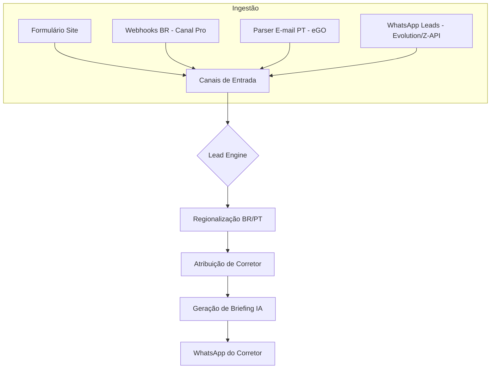

# Fluxos Operacionais ImobIA 🚀

Este documento detalha a arquitetura funcional do ImobIA, cobrindo desde a captura multicanal até a entrega de inteligência ao corretor.

---

## 1. Arquitetura Geral do Fluxo de Leads

O coração da solução é o **Lead Processing Engine**, que orquestra a transformação de um "contato bruto" em um "atendimento qualificado".

---

## 2. Fluxos de Ingestão (Captura)

O ImobIA está preparado para capturar leads nos principais ecossistemas imobiliários:

### 🇧🇷 Brasil (Canal Pro / WhatsApp)
- **Portais**: Integração via Webhook com VivaReal, ZAP Imóveis e OLX.
- **WhatsApp**: Recepção direta de mensagens e áudios. 
  - > [!IMPORTANT]
  - > Mensagens de áudio são automaticamente transcritas via **OpenAI Whisper** antes de serem processadas.

### 🇵🇹 Portugal (E-mail Parser)
- **Portais**: Leitura automática de notificações de e-mail do eGO Real Estate para leads vindo do Idealista, Imovirtual e Casa SAPO.
- **Terminologia**: O sistema identifica automaticamente termos como "T2, Chiado, Arrendamento" para correta indexação.

---

## 3. Inteligência e Atribuição

Uma vez que o lead entra no sistema, o motor executa as seguintes lógicas:

1.  **Detecção de Região**: O sistema aplica tabelas de impostos (CNPJ/NIF) e terminologia regional de forma isolada por agência.
2.  **A Regra do Plantão (Escala)**:
    - O sistema verifica a **Agenda de Escala**.
    - Se houver um corretor escalado para o dia/hora, ele recebe o lead com prioridade total.
    - Caso contrário, o sistema utiliza o **Round-robin** (fila circular) entre os corretores ativos.
3.  **Property Matching**:
    - A IA analisa o orçamento e bairros de interesse.
    - Seleciona automaticamente os **3 melhores imóveis** do portfólio da agência para sugerir no briefing.

---

## 4. O Briefing (Output Final)

A entrega ao corretor é feita via WhatsApp de forma estruturada:

- **Identificação do Cliente**: Nome e telefone com link direto para chamada.
- **Origem do Lead**: Ex: "Vindo do VivaReal".
- **Resumo IA**: "O cliente busca um apto de 3 quartos no Morumbi até R$ 800k".
- **Sugestões de Atendimento**: "Apresente o Imóvel REF-123 e REF-456 que são compatíveis".

---

## 5. Agenda e Sincronização Unificada

O fluxo pós-atendimento é gerido pela Agenda Inteligente:

- **Agendamento**: O corretor marca visitas ou reuniões no painel.
- **Sincronização**: O sistema gera um link **WebCal (WebCal)**.
  - > [!TIP]
  - > Este link permite que o corretor visualize os seus compromissos do ImobIA diretamente no **Google Calendar** ou **iPhone**, sem precisar de abrir a nossa App.

---

## 6. Gestão da Imobiliária

O administrador tem controle total sobre o ecossistema:
- **Painel de Configurações**: Ativação/Desativação de canais conforme a região.
- **Segurança**: Chaves segredo para validação de Webhooks (Anit-Spam).
- **Escala**: Gestão visual dos corretores de plantão.

---
© 2026 ImobIA — Inteligência Imobiliária de Ponta a Ponta.
