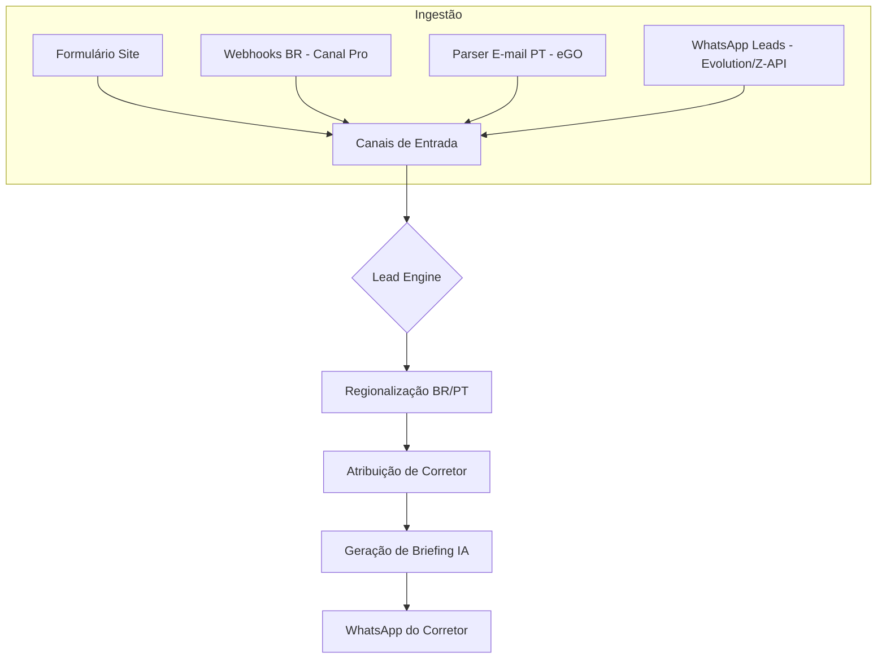

# Fluxos Operacionais ImobIA 🚀

Este documento detalha a arquitetura funcional do ImobIA, cobrindo desde a captura multicanal até a entrega de inteligência ao corretor.

---

## 1. Arquitetura Geral do Fluxo de Leads

O coração da solução é o **Lead Processing Engine**, que orquestra a transformação de um "contato bruto" em um "atendimento qualificado".

---

## 2. Fluxos de Ingestão (Captura)

O ImobIA está preparado para capturar leads nos principais ecossistemas imobiliários:

### 🇧🇷 Brasil (Canal Pro / WhatsApp)
- **Portais**: Integração via Webhook com VivaReal, ZAP Imóveis e OLX.
- **WhatsApp**: Recepção direta de mensagens e áudios. 
  - > [!IMPORTANT]
  - > Mensagens de áudio são automaticamente transcritas via **OpenAI Whisper** antes de serem processadas.

### 🇵🇹 Portugal (E-mail Parser)
- **Portais**: Leitura automática de notificações de e-mail do eGO Real Estate para leads vindo do Idealista, Imovirtual e Casa SAPO.
- **Terminologia**: O sistema identifica automaticamente termos como "T2, Chiado, Arrendamento" para correta indexação.

---

3.  **Property Matching (Engine V2)**:
    - **Filtro de Finalidade**: O sistema separa rigorosamente leads de **Compra** e **Arrendamento/Aluguel**.
    - **Algoritmo de Scoring**: Calcula um índice de 0 a 100% pesando:
        - **Preço**: Recompensas para valores dentro de 15% do orçamento.
        - **Quartos**: Peso maior para match exato.
        - **Localização**: Busca fuzzy (similaridade de texto) para bairros e freguesias.
    - **Transparência**: O corretor vê exatamente o que deu match (ex: "Mesmo Bairro", "Preço Ideal").

---

## 4. O Briefing e Notificações Customizadas

A entrega ao corretor é personalizada por perfil:

- **Preferências do Usuário**: Cada corretor define no painel de configurações se deseja receber alertas por **WhatsApp, E-mail ou Push**.
- **Conteúdo Estruturado**:
    - **Identificação do Cliente**: Nome e telefone com link direto para chamada.
    - **Match Score**: Ex: "92% de Compatibilidade".
    - **Sugestões Justificadas**: "Apresente o Imóvel REF-123 (Mesmo bairro e tipologia)".

---

## 5. Agenda e Sincronização Unificada
(Mantido conforme anterior...)

---

## 6. Gestão e Diagnósticos Administrativos

O administrador tem ferramentas para garantir que o ecossistema está saudável:
- **Painel de Diagnóstico**: Ferramentas integradas para testar o envio de mensagens (WhatsApp e Slack) com log de resposta bruto da API.
- **Segurança**: Chaves de API e Webhook Secrets protegidos.
- **Auditoria de Matching**: Acesso à API de recomendações centralizada para validar sugestões.

---
© 2026 ImobIA — Inteligência Imobiliária de Ponta a Ponta.
